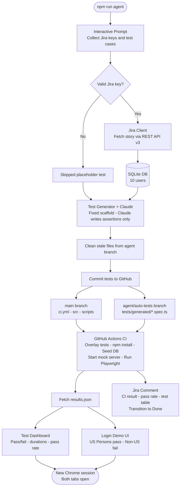

# Agentic AI Playwright POC

An end-to-end **Agentic AI framework** for live demo presentations. The agent reads Jira stories, generates Playwright TypeScript tests via Claude, runs them in GitHub Actions CI/CD, and presents the results in two browser windows — all from a single terminal command.


## Quick demo command

```bash
cd /Users/vikrampb/Projects/agentic-ai-playwright-poc
npm run agent
```

---

## What the agent does in 8 steps

| Step | What happens |
|------|-------------|
| **0** | Interactive prompt — enter Jira keys + plain-English test cases |
| **1** | Ensure GitHub repo exists |
| **2** | Preview SQLite users (tests load them live at runtime) |
| **3** | Prepare `agent/auto-tests` branch — delete stale test files and `results.json` |
| **4** | For each Jira key: fetch story → Claude generates test scaffold → commit |
| **5a** | Clear stale files from agent branch |
| **5b** | Trigger `workflow_dispatch` on GitHub Actions (`ci.yml` on `main`) |
| **5c** | Poll every 15s until workflow completes |
| **6** | Fetch fresh `results.json` from agent branch → build HTML dashboard |
| **7** | Open test dashboard + login UI in a new browser session (two tabs) |
| **8** | Post ADF comment with test results table to every valid Jira ticket → transition to Done |

---

## Interactive demo session example

```
🎤  INTERACTIVE DEMO MODE
──────────────────────────────────────────────────────────
  Story 1 – Jira issue key (or ENTER to finish): AQA-1

  📝  Adding plain-English test cases for AQA-1
    Test case 1 description: Iterate over all users and verify login pass/fail based on export_status
    Endpoint [default: GET /api/login]:
    Expected outcome: US_PERSON users pass, NON_US_PERSON users fail with correct message

  ✅  Story AQA-1 added with 1 custom test case(s)

  Story 2 – Jira issue key (or ENTER to finish): AQA-2
  ...

  Story 3 – Jira issue key (or ENTER to finish):   ← ENTER to start pipeline
```

### Invalid Jira key handling

If you enter a key that doesn't exist (e.g. `AQA-999`):
- The agent catches the 404 gracefully
- A skipped placeholder test is committed for that key
- CI still passes — the skipped test appears with ⏭ in the report
- No Jira comment is posted for the invalid key
- At the end of the run the terminal prints which keys were skipped and why

---

## Architecture



---

## Why two branches?

| | `main` | `agent/auto-tests` |
|---|---|---|
| **Contents** | Source code, CI workflow, package.json | Generated tests, playwright config, results.json |
| **Written by** | Developer (manual) | Agent (every run) |
| **Purpose** | Stable source of truth | Ephemeral — fully replaced each run |

GitHub's `workflow_dispatch` requires `ci.yml` to live on the default branch (`main`). Generated tests live on `agent/auto-tests` so they don't pollute the stable codebase. The CI job overlays both at runtime using `git checkout origin/agent/auto-tests -- tests/`.

---

## Prerequisites

| Tool | Version | How to install |
|------|---------|----------------|
| macOS | 12+ | — |
| Node.js | ≥ 20 | `nvm install 20` |
| Git | any | Xcode CLT |
| GitHub CLI | any | `brew install gh && gh auth login` |
| Google Chrome | any | For new-session browser opens |

---

## Setup (one-time)

```bash
# 1. Clone and install
git clone https://github.com/vikrampb/agentic-ai-playwright-poc.git
cd agentic-ai-playwright-poc
bash setup-mac.sh

# 2. Fill in secrets
cp .env.example .env
# Edit .env — see table below

# 3. Create GitHub repo + set Actions secrets
bash scripts/init-github-repo.sh

# 4. Seed the SQLite database (10 users)
npm run db:init

# 5. Push ci.yml to main
git add .github/workflows/ci.yml
git commit -m "chore: add CI workflow"
git push origin main
```

### Required `.env` values

| Variable | Description |
|----------|-------------|
| `ANTHROPIC_API_KEY` | From console.anthropic.com/keys |
| `JIRA_HOST` | e.g. `mycompany.atlassian.net` — no `https://` |
| `JIRA_EMAIL` | Your Atlassian login email |
| `JIRA_API_TOKEN` | From id.atlassian.com → Security → API tokens |
| `JIRA_ISSUE_KEY` | Fallback key e.g. `AQA-1` |
| `GITHUB_TOKEN` | Fine-grained PAT — Contents, Actions, Workflows, Secrets (Read & write) |
| `GITHUB_OWNER` | Your GitHub username |
| `GITHUB_REPO` | `agentic-ai-playwright-poc` |
| `GITHUB_BRANCH` | `agent/auto-tests` |
| `DB_PATH` | `./data/users.db` (default) |

---

## Database — 10 users

| Name | export_status | username |
|------|--------------|----------|
| Captain America | US_PERSON | captain.america |
| Iron Man | US_PERSON | iron.man |
| Spider-Man | US_PERSON | spider.man |
| Black Widow | US_PERSON | black.widow |
| Hawkeye | US_PERSON | hawkeye |
| War Machine | US_PERSON | war.machine |
| Green Goblin | NON_US_PERSON | green.goblin |
| Doctor Doom | NON_US_PERSON | doctor.doom |
| Red Skull | NON_US_PERSON | red.skull |
| Loki | NON_US_PERSON | loki |

Tests call `GET /api/users` at runtime — adding users to the DB requires zero test code changes.

---

## Mock server endpoints

| Endpoint | Description |
|----------|-------------|
| `GET /api/users` | All users including password (POC only) |
| `GET /api/login?username=u&password=p` | Export-control login |
| `GET /health` | CI liveness probe |

**Server messages:**
- US_PERSON: `"Login successful. Welcome!"`
- NON_US_PERSON: `"Only US Persons are allowed to watch this demo."`

---

## Test generation — how it works

The agent uses a **fixed scaffold template** so Claude never controls the test structure:

1. The file header (`import`, `interface`, helper functions `getUsers`, `login`) is always identical
2. For each plain-English test case you enter → Claude writes only the assertion body statements
3. The agent wraps each body in a `test('your description', ...)` block
4. One test case entered = exactly one `test()` block in the file — no extras
5. If no test cases are entered → two default tests are used (US_PERSON pass / NON_US_PERSON fail)

---

## Local reports

After each run two HTML files open in a new Chrome session:

| File | Contents |
|------|----------|
| `local-reports/report-<id>.html` | Dark-theme test dashboard — pass/fail per test, durations, pass rate, GitHub Actions link |
| `local-reports/login-ui-<id>.html` | Two-column login demo — all US Persons (green ✓) and Non-US Persons (red ✕) |

Both files are saved permanently in `local-reports/` (git-ignored) and can be reopened any time.

---

## Jira comments

Each valid story receives a comment with:
- Story key
- CI Result (PASS / FAIL)
- Pass Rate (e.g. 100% — 2 of 2 tests passed)
- Duration
- Test details table (Suite | Test | Status | Duration)

On a passing run the story is also transitioned to **Done**.

---

## Re-running the demo

`npm run agent` can be run 4–5 times against the same Jira ticket. Each run:
- Deletes stale test files and `results.json` from the agent branch
- Generates fresh tests from whatever you type at the prompt
- Adds a new timestamped comment to each Jira ticket
- Opens fresh browser windows with the latest results

The Jira ticket accumulates a comment history showing each pipeline run — good for demonstrating the agentic loop.

---

## Project structure

```
agentic-ai-playwright-poc/
├── .env.example
├── .github/
│   └── workflows/ci.yml          # GitHub Actions — main branch only
├── data/users.db                 # SQLite — auto-created by npm run db:init
├── local-reports/                # Auto-generated HTML reports (git-ignored)
├── scripts/
│   ├── init-github-repo.sh       # One-time GitHub + secrets setup
│   └── mockServer.ts             # Express API (/api/users, /api/login, /health)
├── src/
│   ├── agent/
│   │   ├── index.ts              # 🤖 Main orchestrator (8-step pipeline)
│   │   ├── prompt.ts             # Interactive terminal prompt
│   │   ├── testGenerator.ts      # Template-based test builder (Claude writes bodies only)
│   │   ├── report.ts             # results.json fetcher + HTML dashboard generator
│   │   └── loginUi.ts            # Two-column animated login demo UI
│   ├── db/
│   │   ├── client.ts             # SQLite query helpers
│   │   └── seed.ts               # 10-user database seeder
│   ├── github/
│   │   └── client.ts             # Octokit wrapper (branch, commit, trigger, poll, fetch)
│   └── jira/
│       └── client.ts             # Atlassian REST API v3 (fetch, comment, transition)
├── DEMO_GUIDE.md                 # Presenter guide with example session
├── package.json
├── setup-mac.sh
└── tsconfig.json
```

---

## Security notes

- Passwords in `data/users.db` are plain-text **for POC only** — use bcrypt/argon2 in production
- `GET /api/users` returns passwords **for POC only** — never expose credentials via API in production
- Never commit `.env` — it is in `.gitignore`
- GitHub fine-grained PAT should be scoped to this repo only and set to expire after the demo
